## UI/UX

### User Interface

Trello’s user interface is well-designed, clean, and user-friendly. It’s simple and visually appealing, especially in the workspace section, where Trello has effectively minimized complexity.

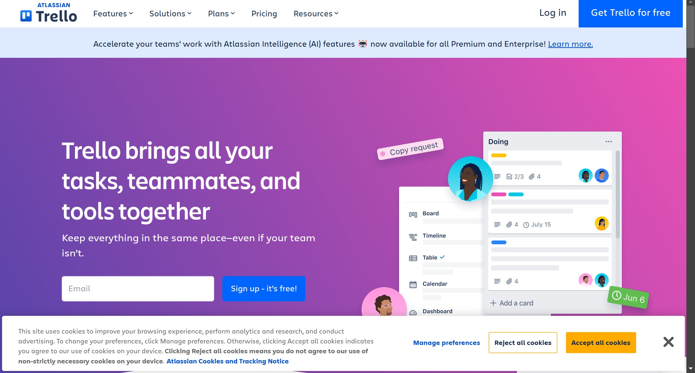

### User Experience

The login process is streamlined and intuitive, making it inviting and easy to sign up or log in.
  
It would be beneficial to remove the **Recently Viewed** section from the workspace. We think navigation should be straightforward, with a single, clear path to access each board. The multiple ways to navigate to a board can feel redundant and cluttered.

> [!NOTE]
> Trello sometimes skips the password requirement when logging in, which seems odd.

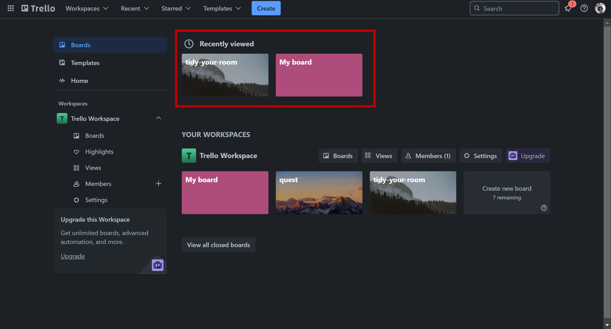

## Features

### Pricing

Trello offers four types of plans:

1. Free
2. Standard
3. Premium
4. Enterprise

As you move up through the plans, each tier provides more features and greater value. Full details on the features for each plan are available on Trello’s website.

This documentation will focus on the Free plan.

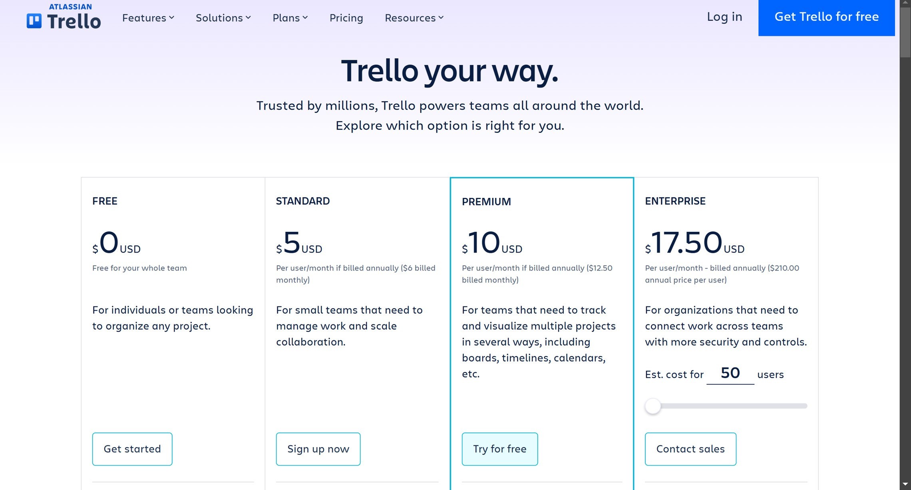

### Sign Up

To sign up for Trello, you can either click the **Sign Up** button in the top-right corner of the page or go to the **Pricing** section, select the Free plan, and proceed to sign up.

On the sign-up page, you have the option to register manually or use a Google account (or other supported accounts) for a faster process. Here’s how to sign up manually:

1. Enter your email address.

2. Complete the CAPTCHA verification.

3. Before setting a password, Trello will prompt you to create a workspace. A workspace is a shared space where you or your team can collaborate, organize tasks, and share project boards.

4. Trello will then prompt you to invite people to your workspace, emphasizing collaboration. This step is optional, so you can skip it if you’re not ready to add team members.

5. You’ll also be offered a 30-day free trial of Trello Premium.

Once these steps are complete, you’ll be signed up successfully.

- This sign-up process is based on a YouTube tutorial from about a year ago, with only minor changes noticed since then.

- One notable observation is that Trello’s sign-up process sometimes skips the password requirement. It is tested with multiple emails: sometimes it requests a password, but at other times it does not, which seems odd.

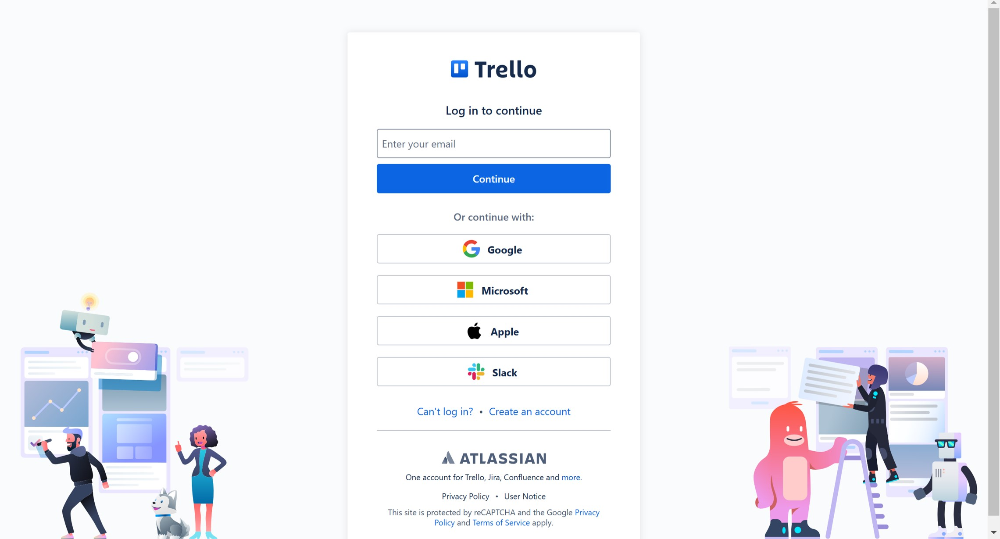

### Workspace

After signing up, you’ll be directed to your workspace page, which is straightforward and user-friendly.

Your workspace is divided into two main sections. Although there’s a right sidebar, it mostly duplicates the features in the left section, so we’ll focus on the left side for clarity.

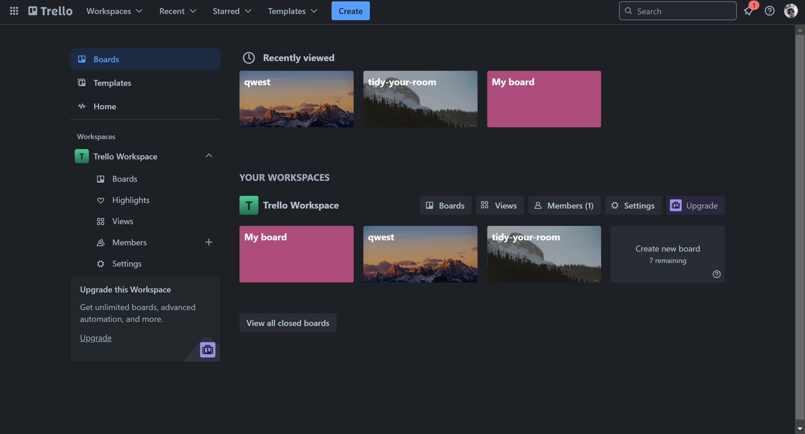

Starting from the top, you’ll see **Boards**, **Templates**, and **Home**:

- **Boards**: This is the main section where you’ll manage and access your project boards. We’ll dive into the board features in detail later.
  
- **Templates**: Here, you can browse a variety of templates organized by category. These templates cover a wide range of project types, including non-technical and non-programming usages.

- **Home**: This page is somewhat redundant, as it only contains two features that are also available on the **Boards** page, offering little additional functionality.

Below these, you’ll find **Workspace Items**, which includes several components:

  - **Boards**: Unlike the top **Boards** section, which displays boards across all workspaces, this section shows only the boards for the current workspace.
   
  - **Highlights**: This section displays your highlighted boards, or boards you’ve marked as favorites, for quick access.
  
  - **Views**: Workspace-level views, such as **Table** and **Calendar**, are available here. However, these views require a Premium upgrade to access.
  
  - **Members**: Here, you can invite people to your workspace via an invite link. You can also add **Guests**—people who are only granted access to specific boards, allowing them to view and edit those boards without joining the full workspace.

  - **Settings**: This section lets you adjust workspace configurations. In the Free plan, options are limited; you can only set workspace visibility to either public or private and link your workspace to **Slack**.

Finally, it’s worth noting that Trello allows you to create multiple workspaces, so you’re not limited to just one, making it easier to organize different projects or teams.

### Board

#### Create Board

On your workspace's home page, click on **Create new board**. Then some options will be provided for you:

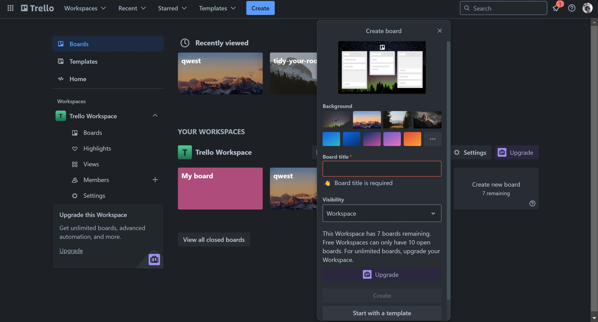

- You can set a background (ether image or a gradient).

- You can (you have to!) set a name to your board

- You can set access to your board:
- Change visibility:
  - Private &rarr; Only board members can see this board.
  - Workspace &rarr; All workspace members can view it.
  - Public &rarr; Anyone on the internet can view it.

- Finally, you can click on **Create** or you can **Start with a template** (which we discussed previously).

#### Inside the Board

Welcome to your board’s page! Your workspace panel is still visible on the left, but you can close it if you prefer a cleaner view.

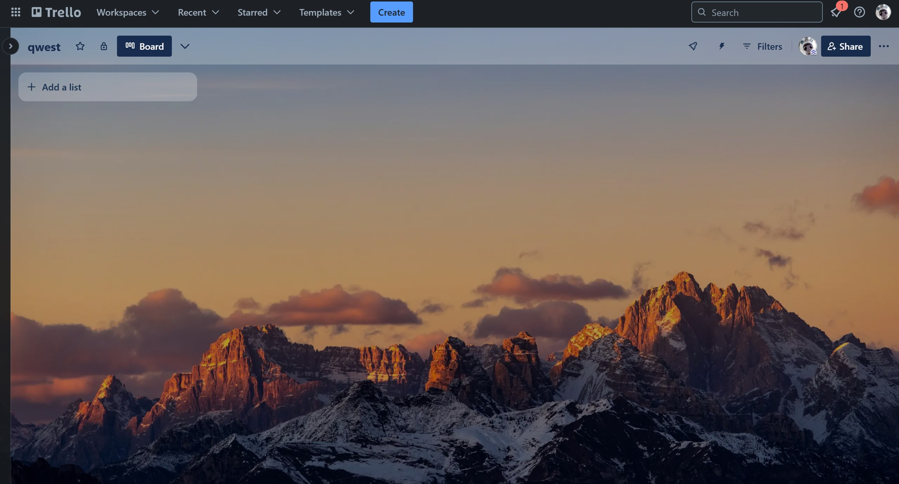

We’ll explore this page from top to bottom, as it’s the most important part of Trello.

##### 1. Workspace panel

Here, we have the workspace panel again, with a few additional options:

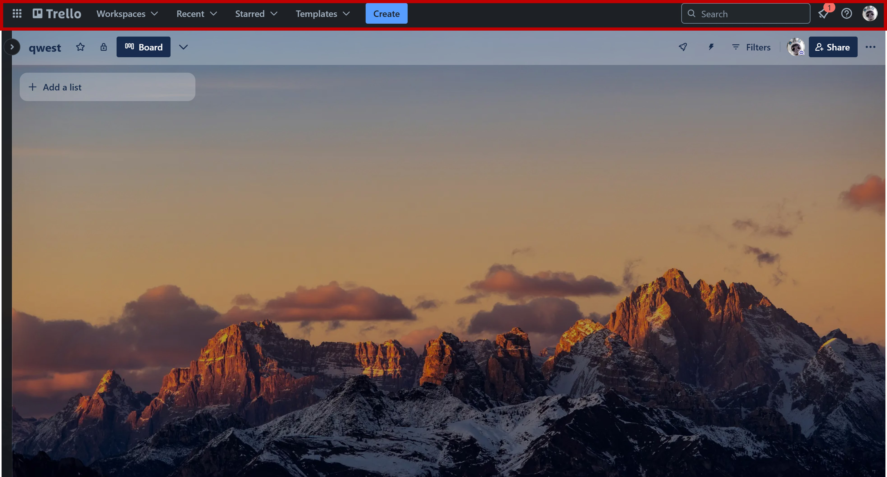

Section | Description
:- | :-
More from Atlassian |  The icon on the far left (a 3x3 grid), which is primarily for advertising other Atlassian products.
Search bar | Use this to find boards within your workspace.
Notifications | See reminders, alerts, and other updates here.
Information | This option leads to a Trello tour, which can be useful if you're new to Trello.
Account | Access and modify your account settings here.

##### 2. Board panel

This section includes options specific to your board:

Section | Description
:- | :-
Name | Double-click the board name to rename it.
Star | Star your board to have it appear at the top of your boards list.
Change visibility | Has already been discussed.
Customize views | The default view is the Kanban board, but Premium users can access additional views like Table, Calendar, Timeline, Dashboard, and Map. Only having the Kanban view can be a disadvantage if you’re looking for more layout options, which might make other tools appealing in comparison.
Power-Ups | Add features and integrations like Google Drive or Slack to your board. Power-Ups work like extensions. E.g., using GitHub power-up, you can attach branches, commits, and other GitHub features directly to your cards.
Automation | Will be explained later.
Filters | Filter cards using options like Members, Due date, Labels, Activity.
Share | Share your board with others.
Menu | A menu with options: Description for the board, See the Activity, Comments, Archived Items, Change Workspace, Set Permissions to the Members, Change Background, Automations, Power-Ups, Labels, Stickers, Watch, Email-to-board (add cards via email), Copy board, Print, export, share, Close the board.

##### 3. View

The default view here is a Kanban board, a visual tool for managing workflows and tracking tasks through stages like "To Do", "In Progress," and "Done." It helps teams quickly see the status of tasks and improve task flow.

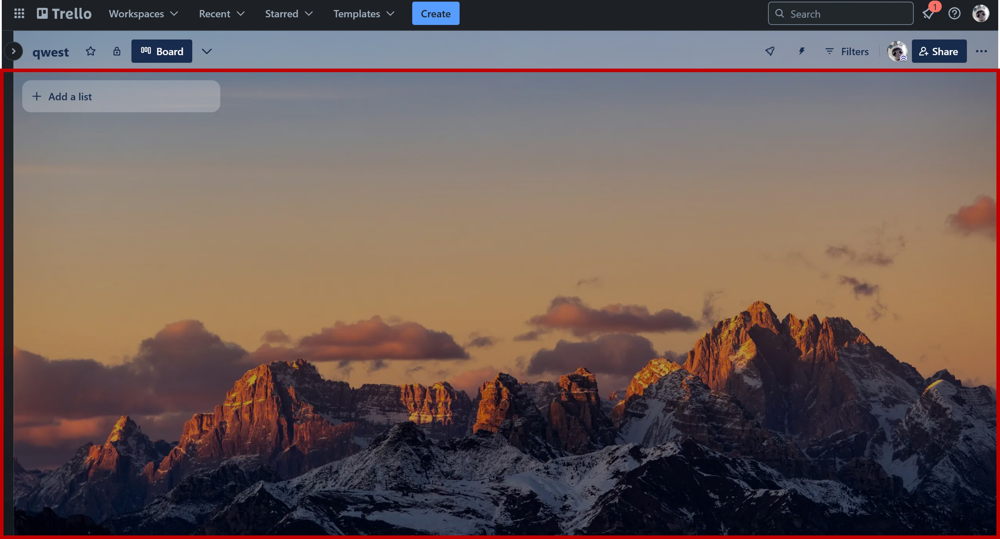

###### Lists

The board consists of **Lists**. Each list represents a stage in the workflow. Typically, there are three lists: To Do, In Progress, and Done. However, you can rename, reorder, or add new lists by double-clicking on their names or dragging them.

###### Cards

Each list consists of  **Cards**. Each card represents a task within a project. Click **Add a card** to name and create a new card. We’ll explain more about card options in detail later.

To open a list’s menu, click on the `...` in the top-right corner. Here, you can:

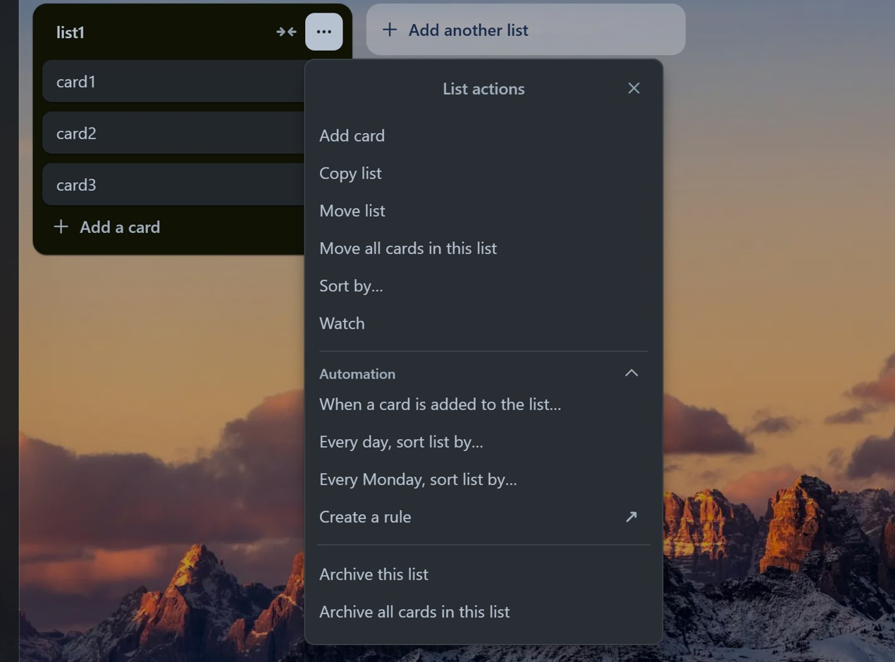

Option | Description
:- | :-
Add card | Add a new card to the list.
Copy list | Create a duplicate of the list by entering a new name and clicking Create list.
Move list | Move the list to a different position.
Move all cards in this list | Transfer all cards to another list.
Sort by | Organize cards by date, name, etc.
Automation | Set automation options for this list.
Archive | Archive the list, making it disappear from the board and moving it to the archived space.

Finally, let’s talk about Cards. Cards represent tasks or individual items within a project. Instead of using the small edit icon beside each card’s name, simply click on the card to open its detailed view, which includes several options:

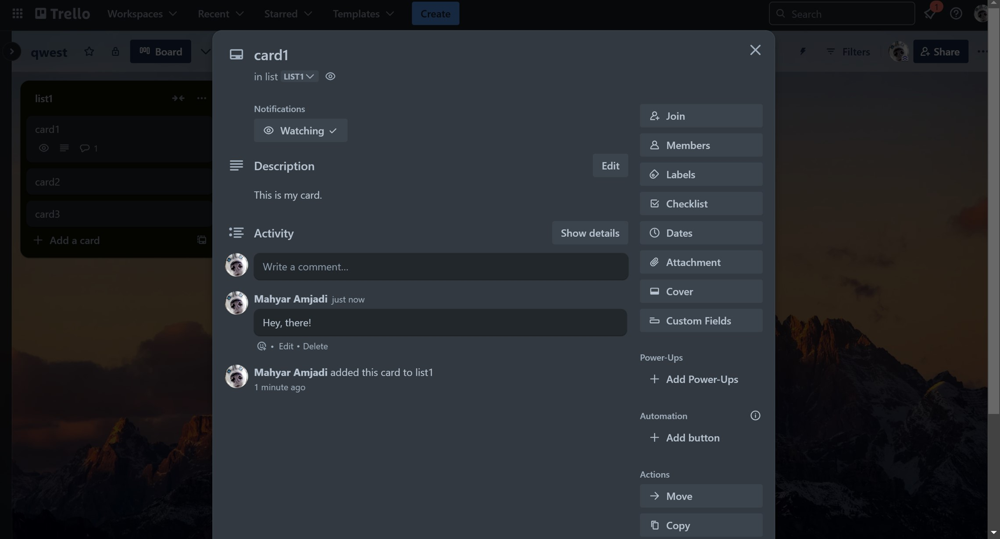

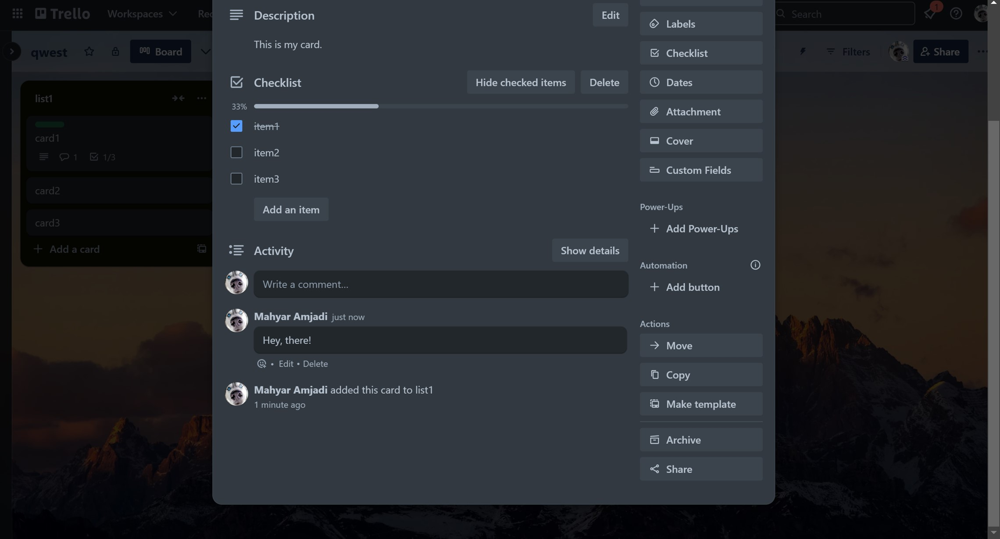

Option | Description
:- | :-
Rename | Rename the card by double-clicking on its title.
Move/Copy | Change the board or list this card belongs to.
Notifications (Watching) | Opt to receive updates for any activity on this card, such as comments or changes.
Description | Provide details or explanations about the task.
Activity | Shows a history of actions and lets you add comments.
Join | Add members to the card for collaboration.
Members | View all members added to the card.
Labels | Assign labels to categorize cards by type or priority. Each label has a color and text. Trello also includes colorblind-friendly options for accessibility. 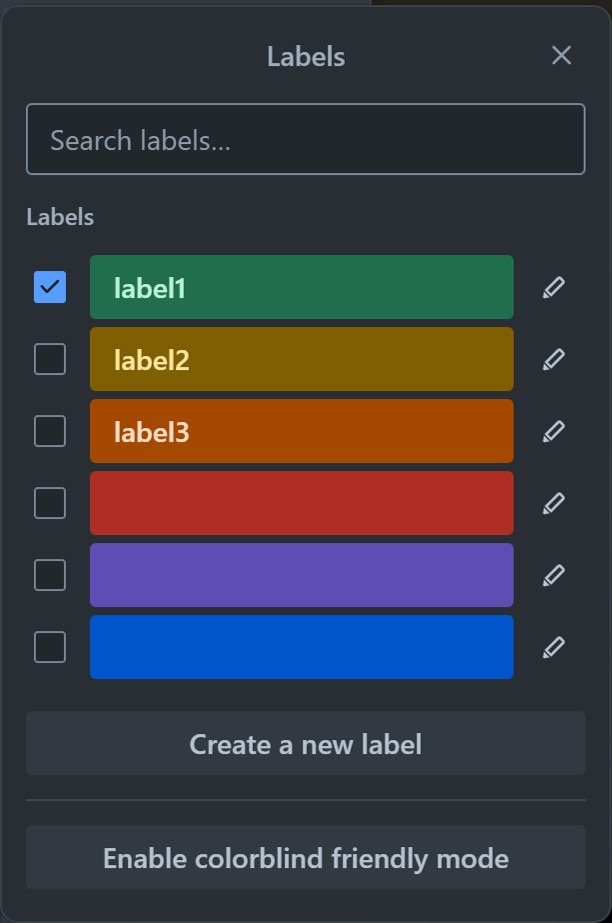
Checklist | A great feature! Add multiple checklists for subtasks, with progress bars to track completion. You can also convert checklist items to individual cards or assign them to members (with due dates in the Premium version). 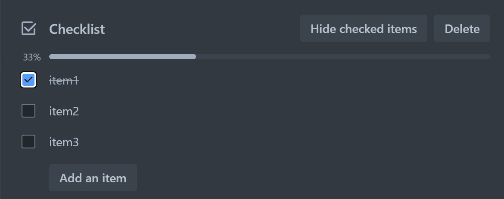
Dates | Set start and due dates for tasks, and choose reminder timings. 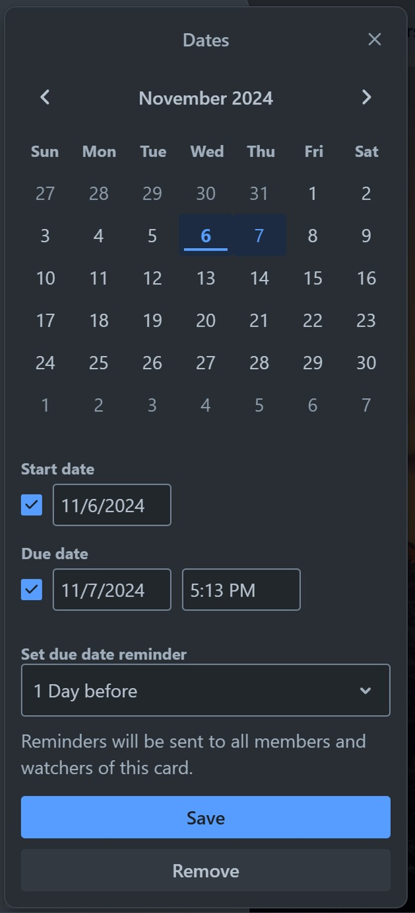
Attachment | Upload files from your device or link to URLs with custom names.
Cover | Add a cover image or color for visual distinction.
Custom Fields | Create custom fields for the card (Premium feature).
Power-Ups | Enable extra functionality on the card.
Automation | Set automated actions for specific workflows.
Actions | Options to Move, Copy, Make Template, Archive, or Share the card.
